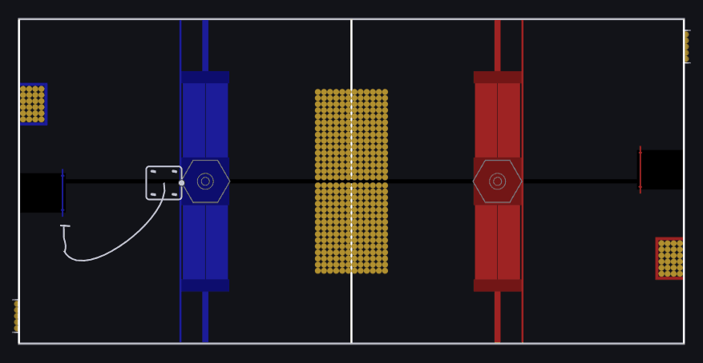
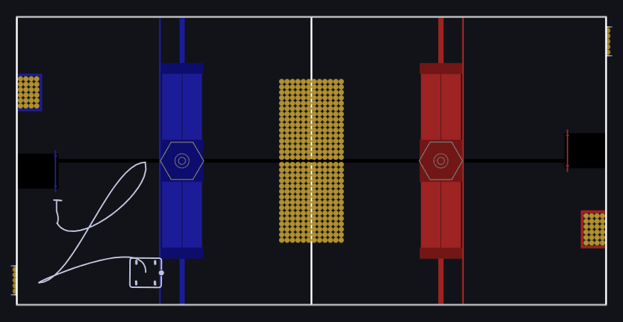
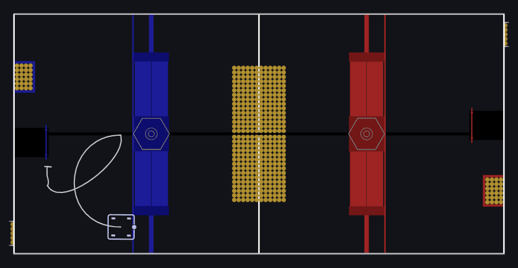

## 1. HP - Collect - Shoot - Climb
Drive path: ~16.5 seconds

## 2. HP - Shoot - Climb
Drive path: ~13.1 seconds

## 3. Center Climb
Drive path: ~10.6 seconds

## 4. Center Climb Field
Drive path: ~2.0 seconds

## 5. Center Double Auto
Drive path: ~12.2 seconds

## 6. HP Double Auto
Drive path: ~11.3 seconds

## 6. HP Double Sweep
Drive path: ~17.8 seconds

## 8. Field Double Sweep
Drive path: ~17.8 seconds

## HH-Center-Climb-HP
Drive path: ~6.1 seconds

## HH-HPStart-Collect-Shoot-Climb
Drive path: ~11.6 seconds

## HH-HPStart-Shoot-Climb
Drive path: ~8.7 seconds

## Delaying

Each one can be delayed (measured in seconds by editing ) `"Smartdashboard/Auto Delay (Seconds)"`
